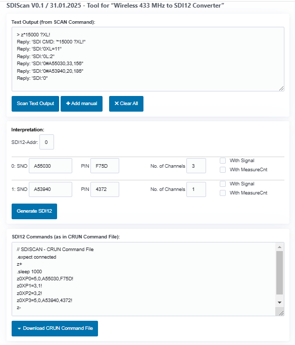

# SDIScan



## Beschreibung

### Übersicht
SDIScan ist ein Tool um die Wireless Minilogger von GeoPrecision (433MHz oder 915MHz) über SDI-12 anzubinden.
Dazu wird ein "Wireless 433/915 MHz to SDI12 Converter" benötigt (siehe dessen separates Datenblatt/Anleitung).
Dieser kann über das Kommando 'aXL!' die umgebenden Logger abfragen. Bedingung ist, dass die Logger "Live-Werte"
senden (das muss jeweils an den Loggern selbst aktiviert werden). Das 'aXL!'-Kommandoe benötigt ca. 15 Sekunden.
Danach werden die empfangenen Geräte als Liste ausgegeben.

Des weiteren wird davon ausgegangen, dass das 'BlxDashboard' verwendet wird. Terminal-Kommandos mit vorangestelltem 'z'
werden vom 'BlxDashboard' über SDI-12 ausgegeben. Natürlich muss ein "Wireless 433/915 MHz to SDI12 Converter" an dem
per Bluetooth verbundenen Gerät angeschlossen sein. Im Folgenden wird '?' als SDI-12 Broadcast Adresse verwendet (Broadcast kann aber nur verwendet werden, wenn nur ein einziger Teilnehmer am SDI-12 Bus angeschlossen ist).
Da der Scan ca. 15 Sekunden dauert, kann das dem 'BlxDashboard' über die Sequenz '*MILISECONDS' (hier '*15000') mitgeteilt werden. Die Antwort des Konverters wird ungefiltert ausgegeben. Ein Beispiel:

``` 
    > z*15000 ?XL!
    Reply: 'SDI CMD: '*15000 ?XL!''
    Wait max. 20 secs
    Reply: 'SDI:'0XL=11''
    Reply: 'SDI:'0L:2''
    Reply: 'SDI:'0#A55030,33,156''
    Reply: 'SDI:'0#A53940,20,186''
    Reply: 'SDI:'0''
```

'z*15000 ?XL!' ist das Kommando, der Konverter antwortet mit SDI-12 Adresse '0' und es wurden 2 Wireless Minilogger gefunden mit den Seriennummern SNO 'A55030' und 'A53940':

```
    ...
    Reply: 'SDI:'0#A55030,33,156''
    Reply: 'SDI:'0#A53940,20,186''
    ...
```

Die restlichen Zeilen sind unwichtig. Der zweite Wert (33 und 20) gibt die Länge der "Live-Daten" (in Bytes) zurück. Diese können sich je nach Logger-Einstellung leicht unterscheiden. Ein "Live-Wert" belegt jeweils 5 Bytes und ca. 15 Bytes nicht benötigter Zusatzdaten.
SDIScan schlägt daher 3 und 1 verfügbare Kanäle vor.

Zusätzlich sind in den "Live-Daten" auch noch die Signalstärke und ein 8-Bit-Zähler, der bei jeder neuen Messung inkrementiert wird, enthalten. Die Signalstärken werden in den obigen Zeilen auch als 3. Wert (156 und 186) angezeigt.

### Der Scan

Die Ausgaben des 'aXL!' können entweder direkt vom 'BlxDashboard' in SDIScan kopiert werden. Alternativ reicht es auch aus,
die Seriennummern SNO (6 Zeichen) in manuellen Zeilen einzutragen. Da jeder Logger eine PIN (4 Zeichen) benötigt, muss diese in jedem
Fall manuell eingetragen werden (die PIN vom Etikett der Wireless Logger). Die Anzahl der verwendeten "Live-Daten" kann ebenfalls justiert werden und optional können Signalstärke und Messungen-Zähler mit erfasst werden.

Die beiden PINs der obigen Logger beispielsweise sind F75D (für A55030) und 4372 (für A53940).

Das Ergebnis sieht so aus (mit Kommenaren)

```
    // SDISCAN - CRUN Command File      // Zeilen mit Anfangs '//' sind Kommntare
    .expect connected                   // erwartet eine Bluetooth-Verbindung
    z+                                  // Schaltet SDI-12 Bus EIN
    .sleep 1000                         // 1 sec
    z0XP0=5,0,A55030,F75D!              // Mit 'XP' Kommandos wird der Konverter 
    z0XP1=3,1!                          // programmiert. Diese erzeugt SDIScan
    z0XP2=3,2!
    z0XP3=5,0,A53940,4372!
    z-                                  // SDI-12 Bus AUS
```

Das 'BlxDasboard' kann auch mehrzeilige Kommandos (genannt CRUN-Dateien) verarbeiten: 
Diese wird mit 'Download CRUN Command File' erzeugt. Das 'BlxDahboard' Terminal-Kommando '.crun' öffnet dann einen Fileselektor
und führt die Datei aus. 


## Installation

SDIScan ist eine reine HTML/JS-Applikation und wurde unter Chrome/Edge entwickelt. 
'index.html' kann auch lokal mit dem Browser und ohne Server geöffnet werden,
das 'BlxDashboard' und eine Arbeitsversion 'SDIScan' befinden sich in den Repositories:

[BlxDashboard (in Repository LTX BLE Demo)](https://joembedded.github.io/ltx_ble_demo/ble_api/index.html)

[SDIScan (this Project)](https://joembedded.github.io/sdiscan/index.html)

## Lizenz

Dieses Projekt steht unter der MIT-Lizenz. 